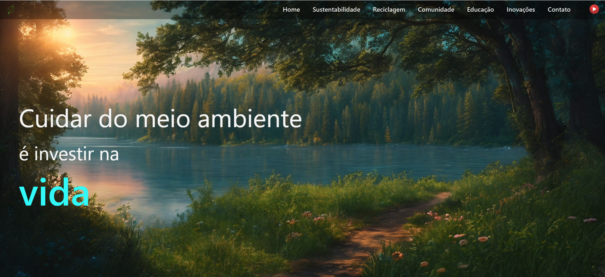

# Ciclo Verde

Projeto acadêmico voltado para **sustentabilidade, reciclagem e conscientização ambiental**. O site apresenta informações, dicas práticas e materiais educativos sobre como cuidar do meio ambiente e incentivar ações comunitárias.

## Tecnologias Utilizadas
- **HTML5** → Estrutura do site  
- **CSS3** → Estilização e responsividade  
- **JavaScript (ES6)** → Navegação dinâmica entre seções  

## Estrutura de Arquivos
├── index.html        # Estrutura principal  
├── style.css         # Estilos e animações  
├── script.js         # Lógica de navegação  
├── img/              # Imagens (logos, ícones, ilustrações)  
└── vid/              # Vídeos de fundo  

## Funcionalidades
- Navegação dinâmica entre seções com **JavaScript puro**  
- **Background em vídeo** na tela inicial  
- Efeitos de **animação com CSS**  
- Conteúdo educativo dividido em: Sustentabilidade, Reciclagem, Comunidade, Educação, Inovações e Contato  

## Contato
**projetocicloverde2025@gmail.com**  

> *Este projeto foi desenvolvido com intuito acadêmico.*
